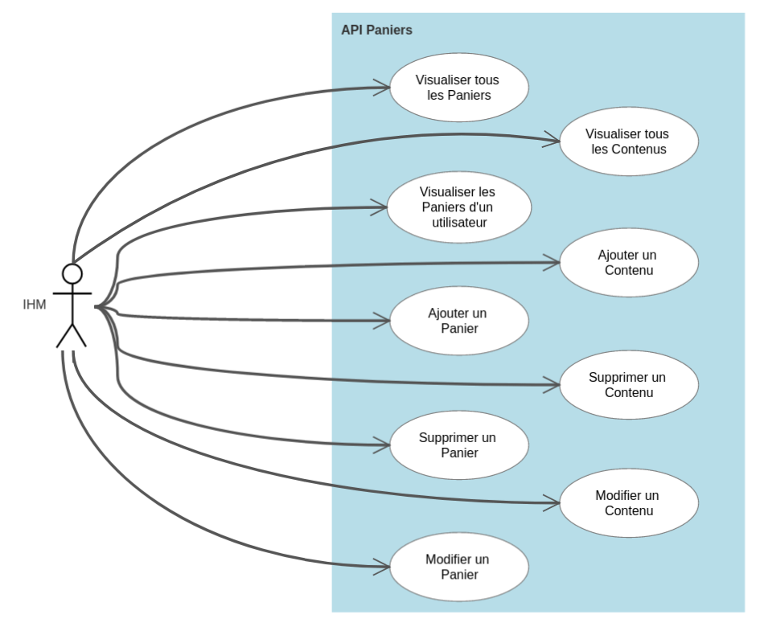

 # Api-Paniers
 Ceci est le répertoire de l'API Paniers réalisé pour le R4.01 Architecture Logicielle fait par Ceccarelli Luca, en collaboration avec Egenscheviller Frédéric qui as fait l'Api Produits et Utilisateurs, et Saadi Nils qui a fait l'IHM.
 
 # Diagramme de classe
 
 ```mermaid
classDiagram
direction BT
class AuthenticationFilter {
  + AuthenticationFilter() 
  - validateToken(String) void
  + filter(ContainerRequestContext) void
}
class Basket {
  + Basket() 
  + Basket(int, Date, boolean, String) 
  - boolean confirmed
  - int basket_id
  - Date confirmation_date
  - String username
   String username
   int basket_id
   boolean confirmed
   Date confirmation_date
}
class BasketManagementApplication {
  + BasketManagementApplication() 
  - closeContentDbConnection(ContentManagementRepositoryInterface) void
  - connectUserApi() UserRepositoryInterface
  - closeBasketDbConnection(BasketManagementRepositoryInterface) void
  - connectProductApi() ProductRepositoryInterface
  - openContentDbConnection() ContentManagementRepositoryInterface
  - openBasketDbConnection() BasketManagementRepositoryInterface
   Set~Object~ singletons
}
class BasketManagementRepositoryInterface {
<<Interface>>
  + updateBasket(int, String, Date, boolean) boolean
  + addBasket(Basket) void
  + getBasketsByUsername(String) ArrayList~Basket~
  + getBasket(int) Basket
  + close() void
  + deleteBasket(int) void
   ArrayList~Basket~ allBaskets
}
class BasketManagementRepositoryMariadb {
  + BasketManagementRepositoryMariadb(String, String, String) 
  + updateBasket(int, String, Date, boolean) boolean
  + getBasketsByUsername(String) ArrayList~Basket~
  + close() void
  + getBasket(int) Basket
  + addBasket(Basket) void
  + deleteBasket(int) void
   ArrayList~Basket~ allBaskets
}
class BasketResource {
  + BasketResource(BasketService) 
  + BasketResource() 
  + BasketResource(BasketManagementRepositoryInterface, UserRepositoryInterface) 
  + updateBasket(int, String) Response
  + getBasketsByUsername(String) String
  + addBasket(String) Response
  + getBasket(int) String
  + deleteBasket(int) Response
   String allBaskets
}
class BasketService {
  + BasketService(BasketManagementRepositoryInterface, UserRepositoryInterface) 
  + deleteBasket(int) void
  + updateBasket(int, Basket) boolean
  + getBasketJSON(int) String
  + addBasket(Basket) void
  + getBasketsByUsernameJSON(String) String
   String allBasketsJSON
}
class Content {
  + Content(int, String, int) 
  + Content() 
  - String product_name
  - int quantity
  - int basket_id
   int quantity
   String product_name
   int basket_id
}
class ContentManagementRepositoryInterface {
<<Interface>>
  + close() void
  + updateContent(int, String, int) boolean
  + deleteContent(int, String) void
  + getAllContentsFromBasket(int) ArrayList~Content~
  + getContent(int, String) Content
  + addContent(Content) void
   ArrayList~Content~ allContents
}
class ContentManagementRepositoryMariadb {
  + ContentManagementRepositoryMariadb(String, String, String) 
  + getContent(int, String) Content
  + getAllContentsFromBasket(int) ArrayList~Content~
  + close() void
  + addContent(Content) void
  + deleteContent(int, String) void
  + updateContent(int, String, int) boolean
   ArrayList~Content~ allContents
}
class ContentResource {
  + ContentResource(ContentManagementRepositoryInterface, ProductRepositoryInterface) 
  + ContentResource() 
  + ContentResource(ContentService) 
  + updateContent(int, String, String) Response
  + addContent(String) Response
  + getAllContentsFromBasket(int) String
  + deleteContent(int, String) Response
  + getContent(int, String) String
   String allContents
}
class ContentService {
  + ContentService(ContentManagementRepositoryInterface, ProductRepositoryInterface) 
  + getContentJSON(int, String) String
  + deleteContent(int, String) void
  + getAllContentsFromBasket(int) String
  + addContent(Content) void
  + updateContent(int, String, Content) boolean
   String allContentsJSON
}
class Product {
  + Product(String, int, float, String) 
  + Product() 
  # String name
  # String unit
  # int quantity_stock
  # float price
   String name
   int quantity_stock
   String unit
   float price
}
class User {
  + User(String, String, String, String, String, String) 
  + User() 
  # String password
  # String mail
  # String firstname
  # String username
  # String role
  # String lastname
   String firstname
   String password
   String username
   String mail
   String lastname
   String role
}

BasketManagementApplication  ..>  AuthenticationFilter : «create»
BasketManagementApplication  ..>  BasketManagementRepositoryMariadb : «create»
BasketManagementApplication  ..>  BasketResource : «create»
BasketManagementApplication  ..>  BasketService : «create»
BasketManagementApplication  ..>  ContentManagementRepositoryMariadb : «create»
BasketManagementApplication  ..>  ContentResource : «create»
BasketManagementApplication  ..>  ContentService : «create»
BasketManagementRepositoryMariadb  ..>  Basket : «create»
BasketManagementRepositoryMariadb  ..>  BasketManagementRepositoryInterface 
BasketResource  ..>  BasketService : «create»
BasketResource "1" *--> "service 1" BasketService 
BasketService "1" *--> "basketRepo 1" BasketManagementRepositoryInterface 
ContentManagementRepositoryMariadb  ..>  Content : «create»
ContentManagementRepositoryMariadb  ..>  ContentManagementRepositoryInterface 
ContentResource "1" *--> "service 1" ContentService 
ContentResource  ..>  ContentService : «create»
ContentService "1" *--> "contentRepo 1" ContentManagementRepositoryInterface 
```
 
  # Fonctionnalités implementées
 ```bash
 //Basket
 //All baskets
 curl -H "Authorization: Bearer token" http://localhost:8080/API-Paniers-1.0-SNAPSHOT/api/baskets
 //Get basket
 curl -H "Authorization: Bearer token" http://localhost:8080/API-Paniers-1.0-SNAPSHOT/api/baskets/1
 //Add
 curl -H "Authorization: Bearer token" -H "Content-Type: application/json" -X POST -d '{"basket_id": 1, "confirmation_date":"2023-04-07", "confirmed":false, "username":"john"}' http://localhost:8080/API-Paniers-1.0-SNAPSHOT/api/baskets
 //Delete
 curl -H "Authorization: Bearer token" -X DELETE http://localhost:8080/API-Paniers-1.0-SNAPSHOT/api/baskets/1
 //Update
 curl -H "Authorization: Bearer token" -H "Content-Type: application/json" -X PUT -d '{"basket_id": 1, "confirmation_date":"2023-04-07", "confirmed":true, "username":"john"}' http://localhost:8080/API-Paniers-1.0-SNAPSHOT/api/baskets/1
 //Get all baskets of a user
 curl -H "Authorization: Bearer token" http://localhost:8080/API-Paniers-1.0-SNAPSHOT/api/baskets/john

//Content
//All
curl -H "Authorization: Bearer token" -X GET http://localhost:8080/API-Paniers-1.0-SNAPSHOT/api/contents
//All contents from a basket
curl -H "Authorization: Bearer token" -X GET http://localhost:8080/API-Paniers-1.0-SNAPSHOT/api/contents/1
//Get
curl -H "Authorization: Bearer token" -X GET http://localhost:8080/API-Paniers-1.0-SNAPSHOT/api/contents/1/product1
//Add
curl -H "Authorization: Bearer token" -H "Content-Type: application/json" -X POST -d '{"basket_id":1,"product_name":"product1","quantity":10}' http://localhost:8080/API-Paniers-1.0-SNAPSHOT/api/contents
//Delete
curl -H "Authorization: Bearer token" -X DELETE http://localhost:8080/API-Paniers-1.0-SNAPSHOT/api/contents/1/product1
//Update
curl -H "Authorization: Bearer token" -H "Content-Type: application/json" -X PUT -d '{"basket_id":1,"product_name":"product1","quantity":20}' http://localhost:8080/API-Paniers-1.0-SNAPSHOT/api/contents/1/product1
```
 
 # Diagramme de cas d'utilisation

 
 
